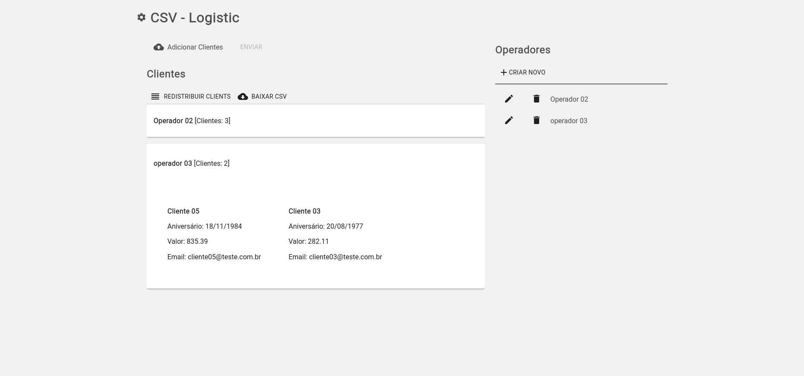

# csv-logistic

<b>csv-logistic</b> permite gerenciar clientes por operadores.
O sistema utiliza a API [csv-logistic-api](https://github.com/carvalho-rafael/csv-logistic-api)

Teste em: https://csv-logistic.netlify.app/.

## Screenshots



### Funcionalidades
- CRUD dos operadores
- Cadastrar clientes através de um arquivo CSV
- Baixar CSV com os clientes atuais
- Redistribuir clients por operadores
_____

## Contribuindo

### Tecnologias utilizadas

- [Nextjs/React](https://nextjs.org/)
- [Typescript](https://www.typescriptlang.org/)
- [Material-ui](https://material-ui.com/)
- [Styled Components](https://styled-components.com/)

### Clone repositório

```bash
git clone https://github.com/carvalho-rafael/csv-logistic-web.git
```

### Get Packages

```bash
yarn install
```

### Definir Ambiente
Copie o arquivo de exemplo:

```bash
cp .env.example .env

#NEXT_PUBLIC_API=[Link para a api do projeto]
```

### Rode o projeto

```bash
yarn dev
```

_____


### Author

<table>
  <tbody>
    <tr>
      <td align="center">
        <a href="https://github.com/carvalho-rafael">
          
          <p>Rafael Carvalho</p>
          <p>Github</p>
        </a>
        <a href="https://www.instagram.com/desenvolvedor.jr/">
        <p>Instagram</p>
        </a>
      </td>
    </tr>
  <tbody>
</table>

